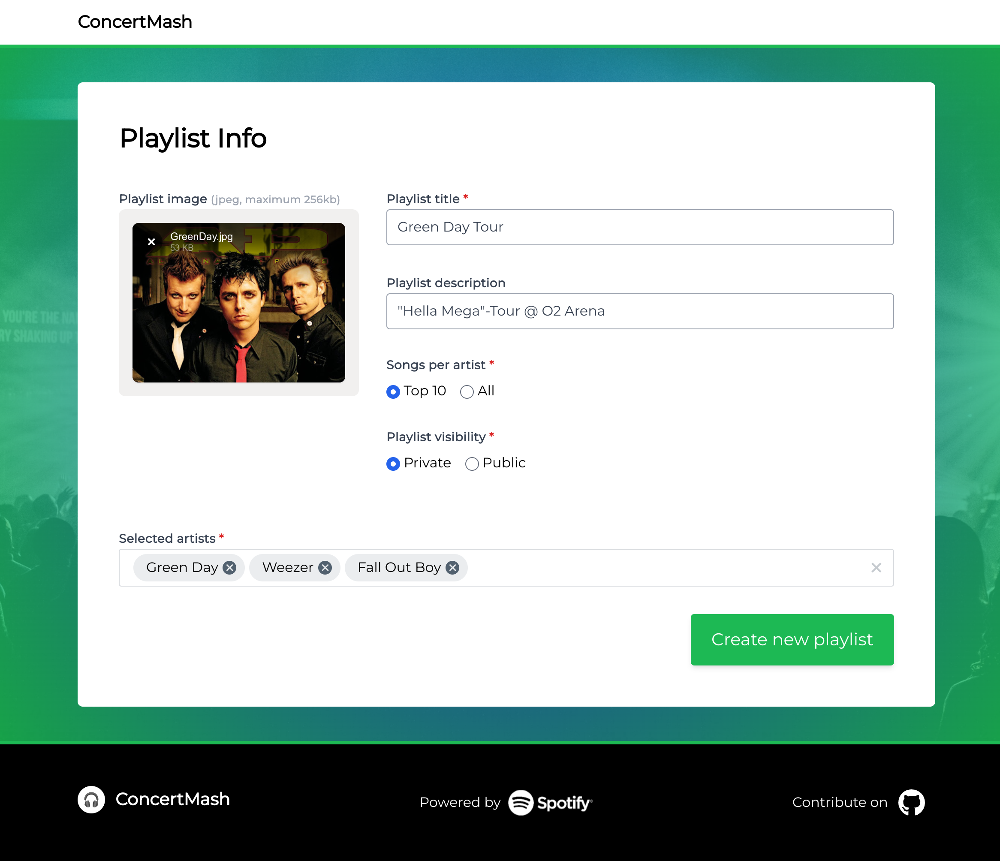

# &#127911; ConcertMash - Easily generate a playlist for your upcoming concerts based on selected artists

---

## &#128640; Features

- &#9889; Generate a playlist based on selected artists
- &#129668; Enter optional values like description, cover image, visibility, etc.
- &#127925; Fine tune your playlist with "songs per artist" and "album type" options
- &#128161; Learn about random music facts while the playlist is generated

---

## &#129300; Why did I create this project?

As a regular music concert and festival attendee, I like to prepare for these events by listening to all the artist's songs.

Before Spotify updated its UI a while ago, it was possible to simply go to the artist's albums, press Ctrl/CMD+A and copy ALL songs directly to a playlist. This was a manual effort and took some time, but it was manageable. Nowadays, there is no easy way to select all songs, it is only possible to copy album by album to a playlist. Imagine doing that for bands or artists who have existed for more than 10 years.

With ConcertMash, you simply enter the artists you want, choose if you want only the top 10 songs for each artist (recommended for festivals) or all songs (recommended for concerts e.g. 1-6 bands), and your playlist will be ready in seconds.

---

## &#128187; Contributors welcome!

I have built the application primarily to serve my own needs, but I am sure there are plenty of useful features that could be important for others!

There are a couple of open GitHub issues that can be tackled. Any help is welcome!

---

## &#129374; Tech Stack

SvelteKit, Svelte, Typescript, TailwindCSS, Filepond, Spotify Web API
